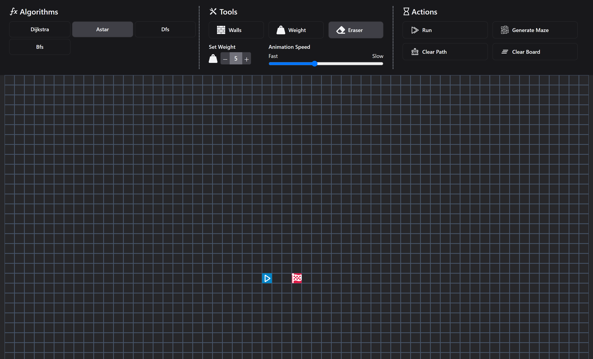

# [Pathfinds](https://github.com/TheArcus02/Pathfinds)

Pathfinds is web application that visualizes pathfinding algorithms such as Dijkstra, A*, DFS, BFS. 
It has interactive board with ability to create walls and weights. Application also provides option to generate mazes with Prim's algorithm.

[](https://pathfinds.netlify.app/)


## Tech Stack

- **Framework:** [React.js](https://react.dev/)
- **Styling:** [Tailwind CSS](https://tailwindcss.com)
- **State management:** [Redux](https://redux-toolkit.js.org/)


## Running Locally

1. Clone the repository

   ```bash
   git clone https://github.com/TheArcus02/Better-GPT.git
   ```

2. Install dependencies using pnpm

   ```bash
   npm install
   ```


3. Start the development server

   ```bash
   npm run dev
   ```

## How do I deploy this?

Follow the deployment guides for [Netlify](https://www.netlify.com/with/react/) for more information.

## License

Licensed under the MIT License. Check the [LICENSE](./LICENSE) file for details.